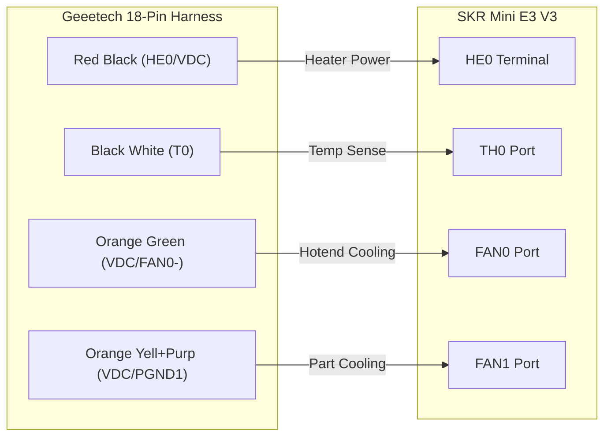

# Upgrading Geeetech A10 (GT2560 V4) → BTT SKR Mini E3 V3
Status: Verified Wiring & Configuration  
Target hardware: Geeetech A10 (stock 18‑pin harness) → BTT SKR Mini E3 V3  
Objective: Replace the GT2560 V4.0 mainboard with the SKR Mini E3 V3 without swapping the main extruder harness.

---

## Summary
This guide documents the required pin mappings, safety isolations, and recommended Marlin settings to migrate from the GT2560 V4.0 to the BTT SKR Mini E3 V3 while keeping the stock 18‑pin extruder h[...]  

Read the safety warnings and verify every wire with a multimeter before cutting, crimping, or connecting.

---

## Critical Safety Warnings

### DANGER — High voltage hazard
Do NOT reuse the Geeetech external DC MOSFET module to switch AC mains (PS‑ON). That module is designed for low‑voltage DC only. Connecting AC mains to it may cause electrocution, fire, or irrever[...]  

### WARNING — Board short risk (BLTouch-related pins)
If you are NOT using a BLTouch, isolate the following wires in the 18‑pin harness. These pins (PB5, Z0‑, VCC, GND) provide voltage or ground paths that can short to the frame or other connectors, [...]  

Action: Cut these wires short and insulate each individually with heat shrink or high‑quality electrical tape.

---

## Tools & Parts checklist
- Multimeter (for continuity testing)
- Wire cutters / strippers
- Crimping tool and ferrules or soldering iron + heat shrink
- JST‑XH 2‑pin housings (if re‑terminating)
- Heat shrink or electrical tape
- Optional: small mechanical switch for Z‑stop if isolating BLTouch pins

---

## 1) Power & Peripherals

### Heated bed
- The SKR Mini E3 V3 includes a robust onboard bed MOSFET; the external Geeetech MOSFET is not required.
  - Remove the external heated‑bed MOSFET module.
  - Connect the bed heater wires directly to the SKR HB screw terminal.
  - Connect the bed thermistor to the SKR THB port.

### Endstops
- Geeetech uses 3‑wire endstops (VCC, GND, SIG); SKR uses 2‑wire (GND, SIG).
  - Plug the 3‑pin connector into the SKR 2‑pin header aligning GND and SIG; the VCC pin will overhang and remain unconnected.
  - Best practice: depin and insulate the VCC wire completely to avoid accidental shorts.

### Display (BTT TFT35)
- Marlin Mode (12864 emulation): connect EXP1 and EXP2 ribbons.
- Touchscreen Mode: connect the 5‑pin RS232 cable to the TFT header.
- You may wire both and switch modes by long‑pressing the encoder.

---

## 2) Extruder Harness re‑termination
The A10 uses a 2×9 (18‑pin) connector. You must cut the connector and re‑crimp or splice wires into groups for the SKR.

Note: Colors below reflect the stock harness. Always verify continuity with a multimeter before cutting.

Wiring table (mapping from stock harness → SKR Mini E3 V3):
| Function | 18‑Pin Location (Label) | Wire Color(s) | SKR Mini E3 V3 Destination | Connector / Notes |
|---|---:|---|---|---|
| Hotend heater (+ / -) | Row 8 Left (VDC) / Row 9 Right (HE0) | Thick RED / Thick BLACK | HE0 screw terminal | Use ferrules or bare wire to screw terminal |
| Hotend thermistor | Row 5 Left / Row 5 Right (T0) | Thin BLACK / Thin WHITE | TH0 port | JST‑XH 2‑pin |
| Hotend fan (always on) | Row 8 Right (VDC) / Row 1 Left (FAN0-) | (+) ORANGE / (-) GREEN | FAN0 (fan header) | JST‑XH 2‑pin |
| Part cooling fan | Row 8 Right (VDC) split + Row 6 L/R (PGND1) | (+) ORANGE split / (-) YELLOW + VIOLET | FAN1 (fan header) | JST‑XH 2‑pin |

Wiring diagram (Mermaid)


Quick wiring checklist
- [ ] Verify each harness wire with multimeter.
- [ ] Cut and re‑terminate heater wires to HE0 terminal (use ferrules).
- [ ] Re‑terminate thermistor to TH0 JST connector.
- [ ] Connect fans to FAN0 and FAN1 as required.
- [ ] Insulate any unused/overhanging pins.

---

## 3) Critical wire isolation (If NOT using BLTouch)
If you are not using a BLTouch, the following wires must be isolated — they connect to pins used by the extruder PCB and can be live or ground paths.

| Pin location | Label | Color | Required action |
|---|---:|---|---|
| Row 2 Left | PB5 | Gray | Cut short & insulate (ISOLATE) |
| Row 2 Right | Z0- | Blue | Cut short & insulate (ISOLATE) |
| Row 3 Left | VCC | Thin Yellow | Cut short & insulate (ISOLATE) |
| Row 4 Left | GND | Brown | Cut short & insulate (ISOLATE) |

Note: If you plan to use a BLTouch, follow BLTouch wiring and configuration procedures instead of isolating these pins.

Replace the BLTouch wiring with a standard mechanical switch in the SKR Z‑STOP port if you isolate BLTouch pins.

---

## 4) Marlin firmware configuration
Below are the baseline settings used when this migration was verified. Adjust as required for your specific printer and test with M119, heater/thermistor readings, and stepper movement.

Configuration.h 
```c
// --- Configuration.h ---

// 1. MOTHERBOARD: This is pre-set in the BTT firmware. DO NOT CHANGE.
#define MOTHERBOARD BOARD_BTT_SKR_MINI_E3_V3_0

// 2. SERIAL PORTS: As specified in your guide for USB + TFT35 Touch Mode
#define SERIAL_PORT -1
#define SERIAL_PORT_2 2
#define BAUDRATE 115200

// 3. MACHINE NAME: Migrated from your A10 config
#define CUSTOM_MACHINE_NAME "Geeetech A10"

// 4. STEPPER DRIVERS: These are pre-set for the SKR Mini E3. DO NOT CHANGE.
#define X_DRIVER_TYPE  TMC2209
#define Y_DRIVER_TYPE  TMC2209
#define Z_DRIVER_TYPE  TMC2209
#define E0_DRIVER_TYPE TMC2209

// 5. THERMISTORS: Migrated from your A10 config (Stock A10)
#define TEMP_SENSOR_0 1
#define TEMP_SENSOR_BED 1

// 6. TEMP LIMITS: Migrated from your A10 config
#define HEATER_0_MAXTEMP 275
#define BED_MAXTEMP      150

// 7. PID SETTINGS: Migrated from your A10 config.
//    (NOTE: You MUST re-run PID tuning after this upgrade!)
#define DEFAULT_Kp  45.80
#define DEFAULT_Ki   3.61
#define DEFAULT_Kd 145.39

#define PIDTEMPBED
#define DEFAULT_bedKp 182.46
#define DEFAULT_bedKi  35.92
#define DEFAULT_bedKd 231.70

// 8. ENDSTOP LOGIC: As specified in your guide.
//    (This is different from your old config, matching the new board's logic)
#define X_MIN_ENDSTOP_INVERTING false
#define Y_MIN_ENDSTOP_INVERTING false
#define Z_MIN_ENDSTOP_INVERTING false // For the mechanical Z-Stop switch

// 9. MOTOR DIRECTIONS: Migrated from your A10 config
//    (Test and reverse if any axis moves the wrong way during homing)
#define INVERT_X_DIR true
#define INVERT_Y_DIR true
#define INVERT_Z_DIR false
#define INVERT_E0_DIR true

// 10. MACHINE GEOMETRY: Migrated from your A10 config
#define X_BED_SIZE 230
#define Y_BED_SIZE 230
#define X_MIN_POS -11
#define Y_MIN_POS -4
#define Z_MIN_POS 0
#define X_MAX_POS X_BED_SIZE
#define Y_MAX_POS Y_BED_SIZE
#define Z_MAX_POS 260

// 11. STEPS PER MM: Migrated from your A10 config (CRITICAL)
#define DEFAULT_AXIS_STEPS_PER_UNIT   { 80, 80, 400, 93 }

// 12. SPEED & ACCELERATION: Migrated from your A10 config
#define DEFAULT_MAX_FEEDRATE          { 500, 500, 5, 25 }
#define DEFAULT_MAX_ACCELERATION      { 500, 500, 100, 5000 }
#define DEFAULT_ACCELERATION          1000
#define DEFAULT_RETRACT_ACCELERATION  2000
#define DEFAULT_TRAVEL_ACCELERATION   1000
#define JUNCTION_DEVIATION_MM 0.04  // (Your old config used JD, not Classic Jerk)

// 13. LEVELING: Set up for Manual Mesh Leveling
#define MESH_BED_LEVELING    // Enable Manual Mesh Bed Leveling
#define LCD_BED_LEVELING     // Enable the LCD menu for MBL
#define GRID_MAX_POINTS_X 5  // Use a 5x5 grid
#define MESH_INSET 13        // Inset grid from bed edges (from your old PROBING_MARGIN)

// --- Ensure all automatic probe options are DISABLED ---
//#define Z_MIN_PROBE_USES_Z_MIN_ENDSTOP_PIN
//#define BLTOUCH
//#define PROBE_MANUALLY
//#define AUTO_BED_LEVELING_BILINEAR

// 14. DISPLAY: Enable support for the TFT35's "Marlin Mode" (12864 emulation)
#define REPRAP_DISCOUNT_FULL_GRAPHIC_SMART_CONTROLLER

// 15. FILAMENT RUNOUT SENSOR:
#define FILAMENT_RUNOUT_SENSOR
#if ENABLED(FILAMENT_RUNOUT_SENSOR)
  #define FIL_RUNOUT_ENABLED_DEFAULT true
  #define NUM_RUNOUT_SENSORS   1
  // IMPORTANT: Connect your sensor to the E0-DET (E0-STOP) port on the SKR board.
  // The pin (PC15) is defined in the board's pins file.
  #define FIL_RUNOUT_STATE     HIGH       // HIGH = NOT present (from your A10 config)
  #define FILAMENT_RUNOUT_SCRIPT "M600"
#endif

// 16. MISC FEATURES: Migrated from your A10 config
#define PREHEAT_1_LABEL       "PLA"
#define PREHEAT_1_TEMP_HOTEND 190
#define PREHEAT_1_TEMP_BED     60

#define PREHEAT_2_LABEL       "ABS"
#define PREHEAT_2_TEMP_HOTEND 240
#define PREHEAT_2_TEMP_BED     90

#define NOZZLE_PARK_FEATURE // Enable G27 Park Head

#define SPEAKER // Enable beeps and sounds

```

```c
// --- Configuration_adv.h ---

// 1. LINEAR ADVANCE: Migrated from your A10 config
//    (K value may need re-tuning with TMC2209 drivers, but 0.22 is a good start)
#define LIN_ADVANCE
#if ENABLED(LIN_ADVANCE)
  #define ADVANCE_K 0.22
#endif

// 2. ADVANCED PAUSE (M600): Required for the filament runout script
#define ADVANCED_PAUSE_FEATURE
#if ENABLED(ADVANCED_PAUSE_FEATURE)
  // --- Copy ALL M600 settings from your old Configuration_adv.h ---
  #define PAUSE_PARK_RETRACT_FEEDRATE         60
  #define PAUSE_PARK_RETRACT_LENGTH            2
  #define FILAMENT_CHANGE_UNLOAD_FEEDRATE     10
  #define FILAMENT_CHANGE_UNLOAD_ACCEL        25
  #define FILAMENT_CHANGE_UNLOAD_LENGTH      100
  #define FILAMENT_CHANGE_SLOW_LOAD_FEEDRATE   6
  #define FILAMENT_CHANGE_SLOW_LOAD_LENGTH     0
  #define FILAMENT_CHANGE_FAST_LOAD_FEEDRATE   6
  #define FILAMENT_CHANGE_FAST_LOAD_ACCEL     25
  #define FILAMENT_CHANGE_FAST_LOAD_LENGTH     0
  #define ADVANCED_PAUSE_PURGE_FEEDRATE        3
  #define ADVANCED_PAUSE_PURGE_LENGTH         50
  // ... (copy any other M600-related settings you had) ...
#endif

// 3. BABYSTEPPING: Essential for fine-tuning Z offset with manual leveling
#define BABYSTEPPING
#if ENABLED(BABYSTEPPING)
  #define DOUBLECLICK_FOR_Z_BABYSTEPPING // Highly recommended
  // NOTE: Do NOT enable BABYSTEP_ZPROBE_OFFSET, as you are not using a probe.
#endif

// 4. TMC DRIVER SETTINGS: These are pre-set in the BTT firmware.
//    (Verify X_CURRENT 580, Y_CURRENT 580, Z_CURRENT 580, E0_CURRENT 630)
//    (Verify STEALTHCHOP is enabled for quiet operation)
#define STEALTHCHOP_XY
#define STEALTHCHOP_Z
#define STEALTHCHOP_E

// 5. ADAPTIVE STEP SMOOTHING: Good feature, enabled in your old config
#define ADAPTIVE_STEP_SMOOTHING

```

#### Notes
- Always validate endstop behavior using M119 before enabling homing routines.
- Verify thermistor readings at room temperature and after heating.
- If you have different heaters/thermistors, set TEMP_SENSOR_* accordingly.

#### Post-Flash Checklist
This completes the firmware block. After compiling and flashing:
 * Initialize EEPROM: Run M502 followed by M500 to load the new defaults.
 * Test Endstops: Run M119. Manually trigger each endstop (X, Y, Z) and confirm they change from open to TRIGGERED. If they are reversed, flip the logic (e.g., false to true) for that endstop in Configuration.h.
 * Test Motors: Home X, then Y, then Z. If any axis moves away from the endstop, power down and invert its direction (e.g., INVERT_X_DIR true to false) in Configuration.h.
 * Re-Tune PIDs: The new board will have different heating characteristics.
   * M303 E0 S210 C8 (Tune hotend to 210°C for 8 cycles)
   * M303 E-1 S60 C8 (Tune bed to 60°C for 8 cycles)
   * Use the new Kp, Ki, and Kd values returned, and save with M500.
 * Calibrate E-Steps: Verify your 93 steps/mm value is still correct.
 * Run Mesh Leveling: Use the LCD menu (Configuration -> Bed Leveling) to create and save a new bed mesh.

---

## Appendix — Full 18‑Pin connector map
<details>
<summary><strong>Click to expand full pinout table</strong></summary>

| Row | Side | Label | Color | Status |
|---:|---|---|---|---|
| 1 | Left | FAN0- | Green | Used (Hotend Fan -) |
| 1 | Right | FAN1- | (empty) | N/C |
| 2 | Left | PB5 | Gray | Isolate (BLT) |
| 2 | Right | Z0- | Blue | Isolate (BLT) |
| 3 | Left | VCC | Thin Yellow | Isolate (BLT) |
| 3 | Right | T1 | (empty) | N/C |
| 4 | Left | GND | Brown | Isolate (BLT) |
| 4 | Right | T1 | (empty) | N/C |
| 5 | Left | T0 | Black | Used (Thermistor) |
| 5 | Right | T0 | White | Used (Thermistor) |
| 6 | Left | PGND1 | Yellow | Used (Part Fan -) |
| 6 | Right | PGND1 | Purple | Used (Part Fan -) |
| 7 | Left | VDC | (empty) | N/C |
| 7 | Right | PGND1 | (empty) | N/C |
| 8 | Left | VDC | Red | Used (Heater +) |
| 8 | Right | VDC | Orange | Used (Fans +) |
| 9 | Left | HE1 | (empty) | N/C |
| 9 | Right | HE0 | Black | Used (Heater -) |

</details>

---
